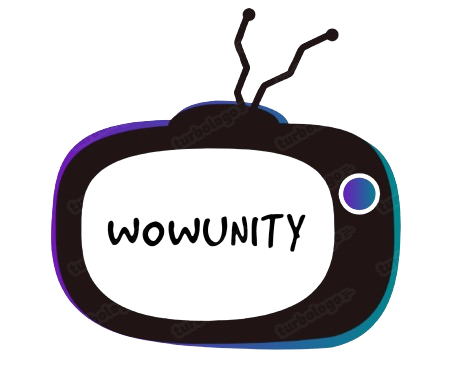
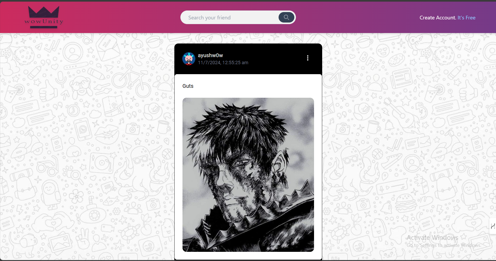
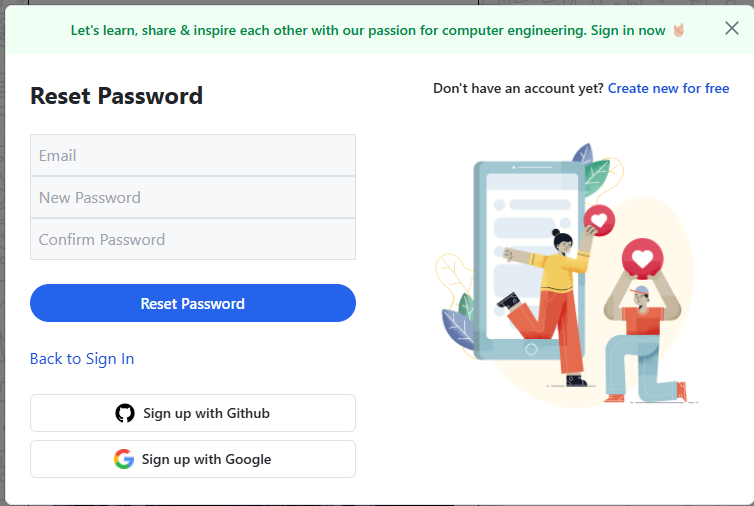
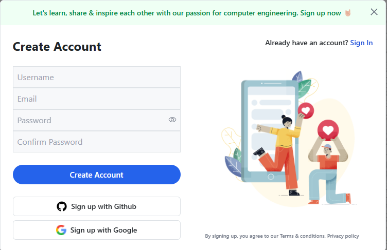
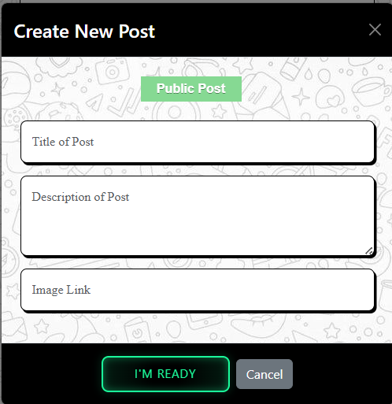
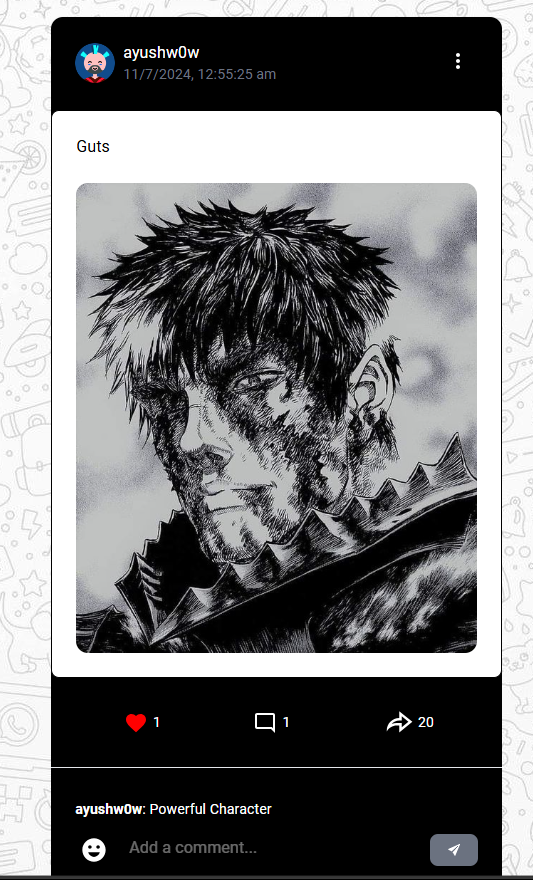
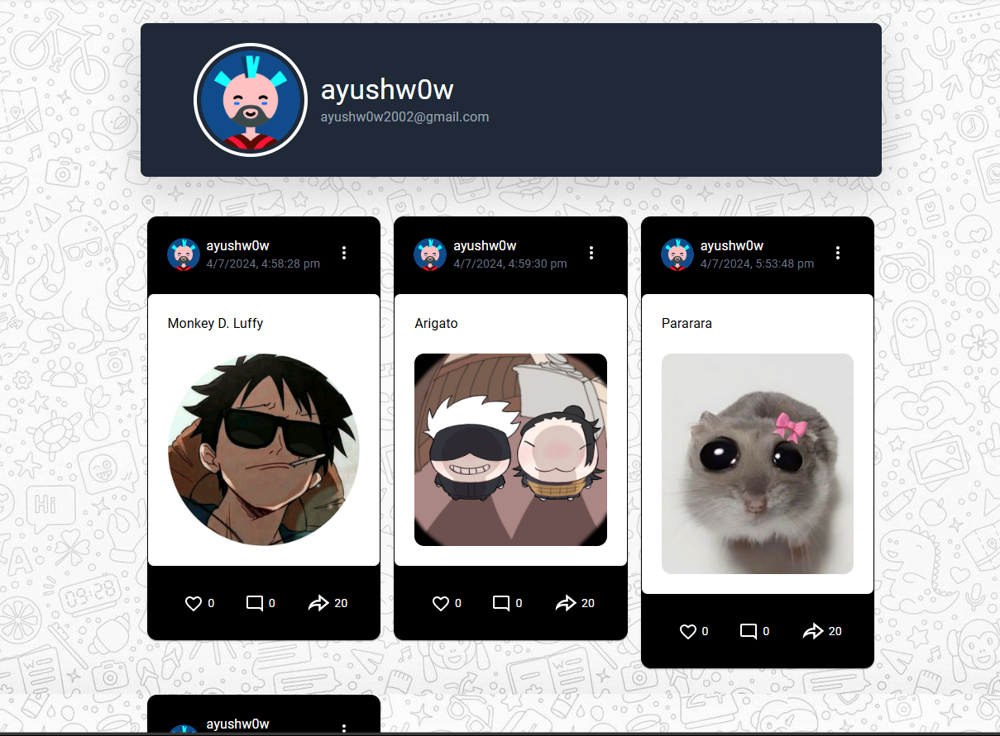

# w0wUnity - Social Media

## Introduction

- This social media platform allows users to create both public and private posts. Built using the MERN stack and TypeScript, it offers a dynamic and responsive user experience across different screen sizes.
- The app showcases robust state management using Recoil and ensures comprehensive input validation using Zod, preventing any invalid data entries.
- It includes functionality for liking, unliking, and commenting on posts.
- The website provides an intuitive and responsive user experience for managing tasks efficiently, with a full RESTful API backend built using Node.js and TypeScript.

## Introduction Video

https://github.com/w0wayush/w0wUnity-Social-Media/assets/113545732/10a728e6-5d42-4ac9-b5f4-1f36b14f91f2

## Tech Stacks

- **Frontend**: HTML, TypeScript, React, Tailwind CSS, Bootstrap, Material UI
- **Backend**: Node.js, Express, MongoDB
- **State Management**: Recoil
- **Input Validation**: Zod
- **Version Control**: Git, Github

## Graphical User Interface

### Front Page

Welcome to w0wUnity! The front page greets users with featured ublic posts and intuitive navigation and also implemented Lazy Loading which keeps loading new Posts when reached end of page.

### Login Page

Easily access your account with our secure login page, designed for a streamlined user experience. In case users forget their login details, a "Forgot Password" link is provided for easy recovery. Upon successful login, the backend initiates the authentication process, granting access to the user's personalized posts section in w0wUnity.

### Sign Up Page

Join w0wUnity today! Our sign-up page makes it simple to create an account and get started.

### Creating New Post

Share your moments with the world! Our intuitive post creation interface supports multimedia uploads, allowing users to craft engaging posts tailored to their preferences and audience.

### Liking and Unliking Post

Enhance engagement with posts by liking and unliking them with a simple click. This feature promotes interaction and showcases user preferences, fostering a vibrant community atmosphere.

### Commenting on Post

Join conversations and express thoughts through comments on posts. The comment section encourages meaningful interactions and facilitates discussions among users, enriching the community experience.

### Personal Profile Section

Manage your profile effortlessly. The personal profile section offers a snapshot of user activity, displaying posted content and interactions in a neatly organized layout.

